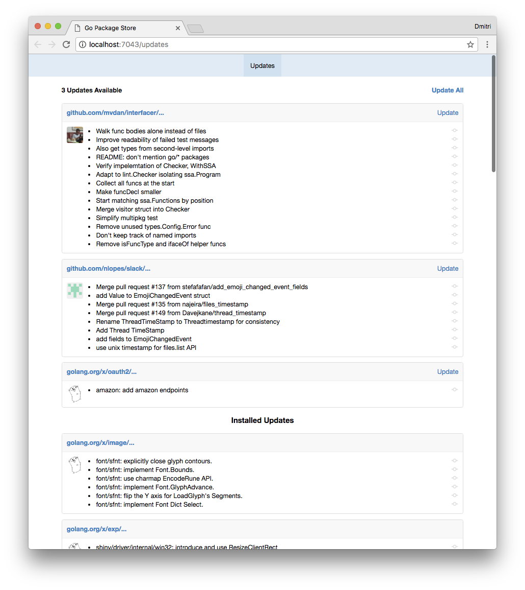

Go Package Store
================

[](https://travis-ci.org/shurcooL/Go-Package-Store) [](https://godoc.org/github.com/shurcooL/Go-Package-Store)

Go Package Store displays updates for the Go packages in your GOPATH.

Installation
------------

```bash
go get -u github.com/shurcooL/Go-Package-Store
```

That will create a binary at `$GOPATH/bin/Go-Package-Store`. You should run it from a terminal where your `$GOPATH` is set.

Usage
-----

```
Usage: Go-Package-Store [flags]
       [newline separated packages] | Go-Package-Store -stdin [flags]
  -git-subrepo string
    	Look for Go packages vendored using git-subrepo in the specified vendor directory.
  -godeps string
    	Read the list of Go packages from the specified Godeps.json file.
  -govendor string
    	Read the list of Go packages from the specified vendor.json file.
  -http string
    	Listen for HTTP connections on this address. (default "localhost:7043")
  -stdin
    	Read the list of newline separated Go packages from stdin.

Examples:
  # Check for updates for all Go packages in GOPATH.
  Go-Package-Store

  # Show updates for all golang.org/x/... packages.
  go list golang.org/x/... | Go-Package-Store -stdin

  # Show updates for all dependencies listed in vendor.json file.
  Go-Package-Store -govendor=/path/to/repo/vendor/vendor.json

  # Show updates for all Go packages vendored using git-subrepo
  # in the specified vendor directory.
  Go-Package-Store -git-subrepo=/path/to/repo/vendor
```

Screenshot
----------



Development
-----------

This package relies on `go generate` directives to process and statically embed assets. For development only, you may need extra dependencies. You can build and run the package in development mode, where all assets are always read and processed from disk:

```bash
go build -tags=dev github.com/shurcooL/Go-Package-Store
```

When you're done with development, you should run `go generate` before committing:

```bash
go generate github.com/shurcooL/Go-Package-Store/...
```

Alternatives
------------

-	[GoFresh](https://github.com/divan/gofresh) - Console tool for checking and updating package dependencies (imports).

License
-------

-	[MIT License](https://opensource.org/licenses/mit-license.php)
